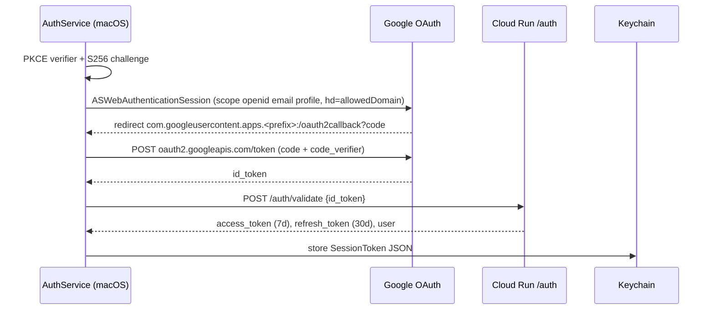

# Authentication, sessions and district configuration

## Sign-in flow

- Client side (`AuthService.performGoogleSignIn`): requires a non-empty `googleClientID` (else `AuthError.missingClientID`), builds the redirect scheme from the client-ID prefix (matching the `CFBundleURLSchemes` entry in `Info.plist`), and passes `hd` as a UX hint only.
- Server side ([Cloud Run API](../backend/cloud-run-api.md) `routes/auth.ts`): verifies the ID token against Google's JWKS with issuer and `aud == GOOGLE_CLIENT_ID`, then requires `hd`, email domain and `email_verified` to match `ALLOWED_DOMAIN`; a 403 becomes `AuthError.invalidDomain`. This server check is the real domain lock.
- Session use: every API call gets its token from `AuthService.getValidSession(updating:)`: (1) a valid stored session, else (2) refresh with the stored refresh token (`/auth/refresh`), else (3) full interactive `signIn()`; on recovery it updates `AppState` so the UI stays consistent. User-dismissed sign-in surfaces as `AuthError.cancelled`, which callers treat as "revert silently" (see [lesson workflow](lesson-workflow.md)). `refreshSessionIfNeeded` refreshes when under an hour remains.
- Storage: `KeychainService` (service name `com.peninsula.lessonlens`) stores the encoded `SessionToken` (`accessToken`, `refreshToken`, `expiresAt`, `user`). `AppState.loadAuthState()` marks the user authenticated only while `expiresAt` is in the future but deliberately keeps expired sessions so a refresh can still work. `signOut` deletes the session (and, in `AuthService.signOut`, the refresh key).

> Observed mismatch to verify before touching refresh: the backend's `/auth/refresh` response contains `access_token`, `refresh_token`, `expires_in` but no `user`, while the app's private `AuthResponse` decodes a non-optional `user`. A refresh therefore appears to fail decoding and fall through to interactive sign-in. Confirm against a live backend before relying on silent refresh.

## District configuration

Per-district values are never in source. Chain: `LessonLens/Config/Local.xcconfig` (git-ignored; template `Local.example.xcconfig`; written by `scripts/configure-app.sh`) -> included by `Shared.xcconfig` (`#include? "Local.xcconfig"`, defaults are placeholders such as `LL_BUNDLE_ID = com.example.lessonlens`) -> `Info.plist` keys `LLBackendHost`, `LLAllowedDomain`, `LLGoogleClientIDPrefix`, URL scheme, and `PRODUCT_BUNDLE_IDENTIFIER` -> `AppConfiguration.load()` at runtime.

| xcconfig key | Meaning |
|---|---|
| `LL_BUNDLE_ID` | bundle id (tests use `$(LL_BUNDLE_ID).tests`) |
| `LL_DEVELOPMENT_TEAM` | Apple team id for signing |
| `LL_BACKEND_HOST` | hostname only, no `https://` (xcconfig treats `//` as a comment) |
| `LL_GOOGLE_CLIENT_ID_PREFIX` | OAuth client id without `.apps.googleusercontent.com` |
| `LL_ALLOWED_DOMAIN` | must equal backend `ALLOWED_DOMAIN` |

Without a `Local.xcconfig` the app builds but cannot sign in, and release packaging is blocked: `scripts/check-app-config.sh <app>` fails if any `LL*` Info.plist value is empty or the bundle id is still `com.example.lessonlens` (it skips apps lacking the keys). `sign-and-package.sh` and `package.sh` call it; the `psd-sign` skill path archives with `xcodebuild` and requires running it manually ([deployment and release](../operations/deployment-and-release.md)).

## Change guidance

- Never reintroduce dev auth bypasses or hardcode client id/host/team (public repo; see conventions in `CLAUDE.md`).
- Adding a configuration value: add the `LL_*` key to `Shared.xcconfig` and `Local.example.xcconfig`, an Info.plist key, a read in `AppConfiguration.load()`, a check in `scripts/check-app-config.sh`, and a prompt in `scripts/configure-app.sh`.
- Changing token shape/lifetime: update `routes/auth.ts` and `AuthService` (`AuthResponse`, `SessionToken`) together; `verifySession` on the backend only needs the HS256 signature and `sub`.
- No automated tests cover `AuthService`; the backend side is exercised only for unauthenticated rejection in `CloudRunBackend/tests/index.test.ts`.
