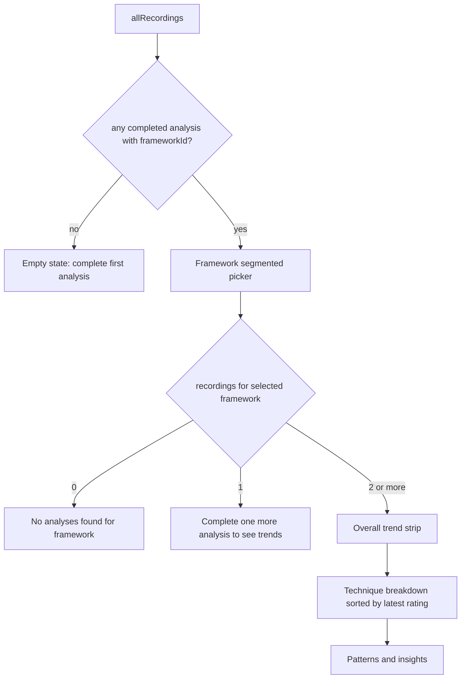

# Growth dashboard

The Growth dashboard is the teacher's longitudinal view: it shows how the ratings from their completed analyses change over time, for one teaching framework at a time. It is a read-only SwiftUI screen in `Features/Growth/` that reads SwiftData directly; it does not call the [Cloud Run API](../backend/cloud-run-api.md) and stores nothing of its own. It is reached from the sidebar through `ContentView`, which shows `GrowthDashboardView()` in the detail pane when `showingGrowthDashboard` is set. The data it reads is produced by the [lesson workflow](lesson-workflow.md), and the frameworks it groups by are defined in [frameworks and techniques](frameworks-and-techniques.md).

**Consult this page when** changing what counts as a trend or insight, adding a chart, or filtering analyses. Ground rules for the underlying model are in the [app overview](overview.md#data-model).

## Inputs

- `@Query(sort: \Recording.createdAt) allRecordings` - all recordings, oldest first. `completedRecordings` keeps `status == .complete`.
- `Analysis.frameworkId` - the `TeachingFramework.rawValue` stored when an analysis is saved. `filteredRecordings` keeps recordings whose analysis matches `selectedFramework`.
- `Analysis.averageRating` - mean of the non-nil `TechniqueEvaluation.rating` values for that analysis (nil when no ratings exist). Used by the trend strip.
- `TechniqueEvaluation.techniqueId`, `techniqueName`, `rating` - the per-technique history. Evaluations with a nil rating are skipped everywhere.

Because `frameworkId` defaults to an empty string on the model, analyses created before framework tracking never match a framework filter and are invisible to the dashboard. That is a deliberate consequence of the additive-property pattern described in the [app overview](overview.md#data-model), not a bug to fix silently.

## Screen states



Caption: the dashboard renders one of three empty states or the full set of sections; the sections only appear with two or more recordings for the selected framework.

- **Framework picker.** `availableFrameworks` is derived from the distinct `frameworkId` values across completed recordings, intersected with `TeachingFramework.allCases` so the order follows the enum. `.onAppear` selects the first available framework when the current selection is not among them.
- **Overall trend.** `OverallTrendSection` draws one circle per recording with a non-nil `averageRating`, coloured with `PSDTheme.ratingColor(Int(avg.rounded()))` and labelled with the date.
- **Technique breakdown.** `TechniqueBreakdownSection` groups ratings by `techniqueId` in chronological order and sorts techniques so the lowest most recent rating appears first ("needs attention at top"). A technique with no rating yet defaults to 5 for sorting.

## Pattern classification

`GrowthPatternAnalyzer.analyze(recordings:)` is a pure static function. It returns `[]` for fewer than two recordings. For each technique with at least two ratings it applies the first matching rule below, where `first` and `last` are the chronological first and last ratings and `avg` is their mean:

<!-- openwiki: mermaid parse failed and this diagram was converted to a text fence so it does not break rendering. Fix the diagram source and restore the mermaid fence. Parser error: Heuristic: an unescaped angle bracket inside a label breaks rendering; rephrase the label. -->
```text
flowchart TD
    S[technique ratings, chronological] --> Q1{all ratings >= 4?}
    Q1 -->|yes| P1[consistentStrength]
    Q1 -->|no| Q2{last > first?}
    Q2 -->|yes| P2[improving]
    Q2 -->|no| Q3{avg <= 2.5?}
    Q3 -->|yes| P3[needsAttention]
    Q3 -->|no| Q4{last < first?}
    Q4 -->|yes| P4[changed]
    Q4 -->|no| N[no insight]
```

Caption: the rule order matters; a technique that is flat and low (`avg <= 2.5`) becomes `needsAttention`, while a technique that drops from a higher start becomes `changed` only when its average is above 2.5.

The result is sorted as needs attention, changed, improving, consistent strength. Each `GrowthPattern` carries a `PatternCategory` (SF Symbol icon and colour) and a Markdown insight string rendered through `MarkdownParser.inline`, so the insight text may contain `**bold**` markers. The wording is deliberately soft ("worth revisiting", "consider focusing your next coaching chat here"), in line with the product rule that the app coaches rather than evaluates; keep new copy in that register.

Caveats for changes:

- `GrowthPattern.id` is a fresh `UUID()` on every analysis run, so pattern identity is not stable across renders; do not key persisted state on it.
- The analyzer and `PatternsInsightsSection` run on every SwiftUI body evaluation; there is no caching.
- The classification ignores recording dates beyond ordering. Two sessions a month apart count the same as two consecutive days.

## Change guidance

- **Adjusting thresholds or categories:** edit `GrowthPatternAnalyzer.analyze` and the `PatternCategory` switch (`icon`, `color`) together; the sort order list lives in the same function. Keep the rule order documented above in sync.
- **Adding a chart or section:** add a sibling struct beside `OverallTrendSection`, feed it the same `filteredRecordings`, and keep the screen-state branching in `GrowthDashboardView.body`.
- **Changing framework grouping:** the filter key is `Analysis.frameworkId`, written by the [lesson workflow](lesson-workflow.md) after a successful analysis. A change to that key or to `TeachingFramework.rawValue` changes which history a teacher sees, so treat it as a data-compatibility change and check [frameworks and techniques](frameworks-and-techniques.md) first.
- **Chat hand-off:** the insight text asks the teacher to pick a focus for their next coaching chat; the chat itself is documented in [reflection, chat and export](reflection-chat-export.md).

## Tests and validation

- There is no dedicated test for `GrowthPatternAnalyzer` or the screen filters in `LessonLens/LessonLensTests/`. Changes here are verified by reasoning against the rules above; a pure-function unit test of `GrowthPatternAnalyzer.analyze` is the narrowest addition if the rules change.
- Narrow check: `xcodebuild -project LessonLens/LessonLens.xcodeproj -scheme LessonLens -destination 'platform=macOS' CODE_SIGNING_ALLOWED=NO build` (macOS with Xcode only; not run in CI, see [build, test and CI](../operations/build-test-ci.md)).
- Not normally needed: the Cloud Run backend and shared prompts, because the dashboard reads only locally stored analyses.
