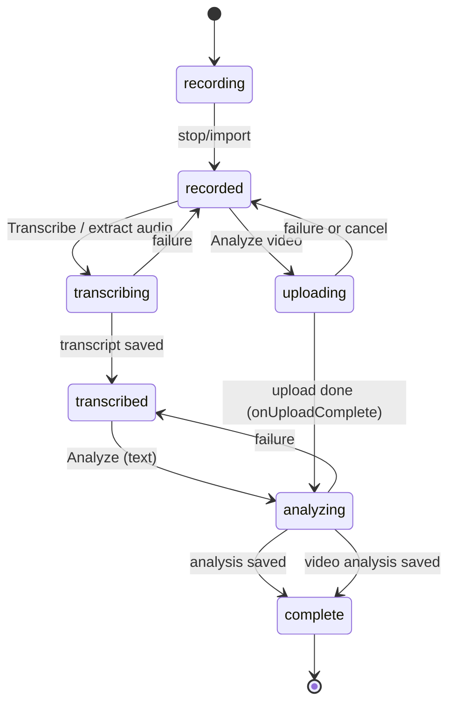

# Lesson workflow

The pipeline is orchestrated by `RecordingDetailView` (private methods `startTranscription`, `startAnalysis(of:...)`, `startVideoAnalysis`, `startAudioExtractionAndTranscription`, `reanalyzeAsNewSession`, `deleteRecording`), which calls services obtained from the [`ServiceContainer`](overview.md). Each service owns one concern and talks to the [Cloud Run API](../backend/cloud-run-api.md) with a bearer token from `AuthService.getValidSession(updating:)` ([auth and config](auth-and-config.md)).

## Inputs

| Input | Service | Rules |
|---|---|---|
| Live recording | `RecordingService` (AVAudioRecorder, level metering, mic permission) | 5-90 minutes (`validateDuration`, `AppConfiguration`); release app needs the `audio-input` entitlement |
| Audio import | `AudioImportService.importAudioFile` | m4a/mp3/wav/aiff/caf; same 5-90 minute bounds (`ImportError`) |
| Video import | `VideoImportService.importVideoFile` | mp4/mov/m4v/webm, `maxFileSize` 10 GB, duration validated; creates `Recording(mediaType: .video, status: .recorded)` reusing the file name for both audio and video paths |

## Status lifecycle

Notes: `recorded`/`transcribed` are the safe resting states; `failed` exists in `RecordingStatus` but the detail-view error paths revert to the last good state instead. On the next launch `Recording.resetInterruptedProcessing` applies the same rule to anything left in `uploading/transcribing/analyzing` (see [app overview](overview.md)). Completed sessions offer **Re-analyze**, which makes a new `Recording` copy titled `"<title> (Re-analysis <date>)"` (sharing the media file and copying `segmentsData`/`pausesData`) so the original feedback, reflection and chats are kept; plain re-analysis of a `transcribed` recording, and any new analysis, clears `reflection` and `chatSessions` on the target recording.

## Transcription (on-device)

`TranscriptionService` wraps WhisperKit: `loadModel()` uses `config.whisperModel` (`openai_whisper-large-v3`, downloaded on demand) or, when `DEV_USE_BUNDLED_MODEL=1` and a bundled folder is found, `openai_whisper-base`. `transcribe` runs `DecodingOptions(language: "en", wordTimestamps: true, chunkingStrategy: .vad)`, maps results to `TranscriptSegment`s (confidence = `exp(avgLogprob)`), and derives `TranscriptPause`s with `detectPauses(in:threshold:)` where `pauseThreshold = 3.0` s (`preceding`/`following` text are 5-word snippets). `detectPauses` is `nonisolated static` so stored segments can be reprocessed without Whisper (`backfillMissingPauses`). Progress comes from a 0.5 s timer polling `whisperKit.progress`. Bundled model files are in an ignored resources path and are not documented here.

Tests: `PauseDetectionTests` (gap at/above threshold detected, below ignored, unsorted input ordered, single segment none), `PauseBackfillTests` (backfill only when missing, idempotent).

## Text analysis

`AnalysisService.analyze` POSTs `{transcript, techniques[{id,name,description,lookFors,exemplarPhrases}], includeRatings, pauseData}` to `/analyze` (300 s timeout; `pauseData` is nil when there are no pauses). It decodes the snake_case reply into `Analysis` + `TechniqueEvaluation`s (matching technique names by id). Status mapping: 200 ok; 429 `rateLimited`; 401/403 auth failure; 5xx `serviceUnavailable`. The backend limits (100k-char transcript, 20 techniques, 100 pauses) are in [Cloud Run API](../backend/cloud-run-api.md). After success the caller stores `analysis.frameworkId = framework.rawValue`, which the [Growth dashboard](growth-dashboard.md) filters on.

## Video analysis

`VideoAnalysisMethod` offers `geminiVideo` ("Video Analysis", ~$0.15-0.27) or `geminiText` ("Audio Only", ~$0.01-0.03). The video path (compress -> Cloud Storage upload -> `/analyze/video`) is detailed in the [video analysis pipeline](../backend/video-analysis-pipeline.md). In `startVideoAnalysis` the analysis and an **on-device transcript extraction** (`AudioExtractionService` -> `TranscriptionService`) run in parallel; the analysis is saved immediately and `status` becomes `complete` without waiting, and the transcript is attached later best-effort (needed for chat; chat extracts it on demand for video-only recordings). Errors with `offersTranscriptFallback` set `videoFallbackMessage` instead of an alert.

## Change guidance

- Adding a pipeline step: keep status transitions reversible and add the new processing status to `RecordingStatus.isProcessing` and `statusAfterInterruptedProcessing`, otherwise launch recovery will miss it.
- Changing the request/response shape with the backend: update `AnalysisService`/`VideoAnalysisService` Codable structs, the route mappers, and [shared prompts](../backend/shared-prompts.md) together; `VideoAnalysisServiceTests` has request-body and status-mapping tests, there is no equivalent for `AnalysisService`.
- Long transcriptions or Whisper behaviour cannot be exercised in CI (WhisperKit models, macOS); rely on the pure static helpers for unit tests.
- Keep copy "coaching, not evaluation" in any user-visible message you touch.
