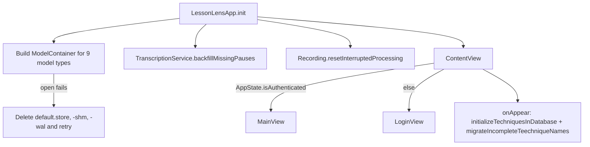
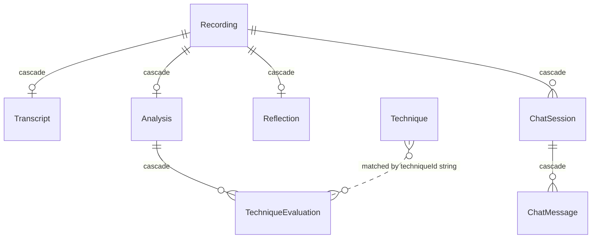

# macOS app overview

A native macOS 14+ app (Apple Silicon, for WhisperKit) written in SwiftUI with SwiftData. Everything a teacher creates lives locally; the only network peers are the [Cloud Run API](../backend/cloud-run-api.md) and Google sign-in. Product rules are in the [architecture overview](../architecture/overview.md).

## Source layout (`LessonLens/LessonLens/`)

| Area | Role | Deeper page |
|---|---|---|
| `App/` | `LessonLensApp` (`@main`), `AppState`, `ServiceContainer`/`AppConfiguration` | this page |
| `Core/Models/` | SwiftData `@Model` types + `TeachingFramework` enum | this page |
| `Core/Views/ContentView.swift` | auth gate, `MainView` split view, sidebar, welcome | this page |
| `Core/Theme/`, `Core/Services/KeychainService.swift` | PSD branding (`PSDColors`, `PSDTheme`, `PSDFonts`), Keychain wrapper | [auth and config](auth-and-config.md) |
| `Features/Recording`, `Transcription`, `Analysis` | capture/import, WhisperKit, backend analysis | [lesson workflow](lesson-workflow.md) |
| `Features/Techniques` | frameworks and technique definitions | [frameworks and techniques](frameworks-and-techniques.md) |
| `Features/Reflection`, `Chat`, `Export` | self-reflection wizard, coaching chat, PDF/Markdown export | [reflection, chat and export](reflection-chat-export.md) |
| `Features/Growth` | growth dashboard (completed recordings filtered by `analysis.frameworkId`) | [growth dashboard](growth-dashboard.md) |
| `Features/HowItWorks`, `Legal`, `Settings` | explainer, terms/privacy view, Settings window and `UserSettings` preferences | [settings, explainer and legal](settings-and-legal.md) |

`LessonLens/Package.swift` is a legacy manifest unused by the Xcode build; dependencies (WhisperKit) are declared in the `.xcodeproj` (see [build, test and CI](../operations/build-test-ci.md)).

## Startup and wiring

- `ServiceContainer.shared` (a `@MainActor @Observable` singleton injected through `EnvironmentValues.serviceContainer`) constructs every service with the same `AppConfiguration`: `AuthService`, `RecordingService`, `AudioImportService`, `VideoImportService`, `TranscriptionService`, `AnalysisService`, `VideoAnalysisService`, `AudioExtractionService`, `TechniqueService`, `ExportService`, `ChatService`. New services belong here and views reach them via `@Environment(\.serviceContainer)`.
- `AppConfiguration.load()` reads `LLBackendHost`, `LLGoogleClientIDPrefix`, `LLAllowedDomain` from Info.plist (populated from xcconfig - see [auth and config](auth-and-config.md)) and hard-codes recording bounds (5-90 minutes), `whisperModel = "openai_whisper-large-v3"` and `devUseBundledModel` from env `DEV_USE_BUNDLED_MODEL=1`. An empty host becomes `backend-not-configured.invalid`.
- `AppState` (`@MainActor ObservableObject`) holds global auth/recording/error state. On init it restores a Keychain session; an expired access token leaves `isAuthenticated=false` but keeps the stored session so `AuthService.getValidSession` can try the 30-day refresh token.
- `AppState.swift` also defines the typed error enums (`AppError` wrapping `RecordingError`, `TranscriptionError`, `AnalysisError`, `NetworkError`, `ImportError`, `VideoImportError`, `VideoAnalysisError`) surfaced by `ContentView`'s single alert. Copy in these messages must stay "coaching, not evaluation".

## Data model

- `Recording` (`@Attribute(.unique) id`): `title`, `duration`, `audioFilePath`, optional `videoFilePath` (both **relative** names under `~/Library/Application Support/com.peninsula.lessonlens/Recordings/`, resolved by `absoluteAudioPath`/`absoluteVideoPath`), `mediaType` (`audio|video`), `status`, `isImported`.
- `RecordingStatus`: `recording, recorded, uploading, transcribing, transcribed, analyzing, complete, failed`; `isProcessing` = uploading/transcribing/analyzing; `canBeAnalyzed` = `transcribed` with a transcript. Lifecycle diagram in [lesson workflow](lesson-workflow.md).
- `Transcript`: `fullText`, JSON-encoded `segmentsData` (`TranscriptSegment` with start/end/confidence) and `pausesData` (`TranscriptPause`). `Analysis`: summary, `strengthsData`/`growthAreasData`/`actionableNextStepsData` JSON arrays, `modelUsed`, `ratingsIncluded`, `frameworkId`. `TechniqueEvaluation`: `techniqueId`, denormalised `techniqueName`, optional `rating` (1-5), `wasObserved`, JSON `evidence`/`suggestions`. `Reflection`: `whatWentWell`, `whatToChange`, `isComplete`, `wasSkipped`, JSON `selfRatings` + `focusTechniqueIds`. `ChatSession`/`ChatMessage` (role string `user|assistant`).
- Array-valued fields are stored as `Data` with computed `[T]` accessors; follow that pattern for new list fields.
- The whole schema is listed in `LessonLensApp.sharedModelContainer`; a new `@Model` must be added there.

## Launch-time repairs (tested)

- `Recording.resetInterruptedProcessing(in:)` - any recording left in a processing status by a quit/crash returns to the last finished step (`analysis != nil` -> `complete`, `transcript != nil` -> `transcribed`, else `recorded`). Tests: `InterruptedProcessingTests` (`testMidProcessRecordingsFallBackToLastFinishedStep`, `testSettledRecordingsAreLeftAlone`).
- `TranscriptionService.backfillMissingPauses(in:)` - rebuilds pauses from stored segments for old transcripts; idempotent. Tests: `PauseBackfillTests`.

## Hazards

- **Schema change = possible data loss.** `LessonLensApp` responds to any `ModelContainer` failure by deleting `default.store*` in Application Support and recreating, so an incompatible `@Model` edit silently wipes teachers' sessions on their machines. Prefer additive properties with defaults (as `mediaType`, `ratingsIncluded`, `frameworkId` do) and discuss before changing schema.
- Release builds are intentionally **not sandboxed**, so data lives at `~/Library/Application Support/default.store` and the `com.peninsula.lessonlens/Recordings` folder (see [deployment and release](../operations/deployment-and-release.md)).
- Re-analysis creates a *copy* `Recording` that shares the original's media file; `deleteRecording` only removes the media when no other recording references the same `audioFilePath` (see [lesson workflow](lesson-workflow.md)).

## Where to start

UI navigation: `ContentView.swift` (`MainView`, `SidebarView`, `WelcomeView`). Persistence: `Core/Models/*`. Cross-cutting services: `ServiceContainer.swift`. Run `xcodebuild ... test` (macOS only) for model or lifecycle changes.
