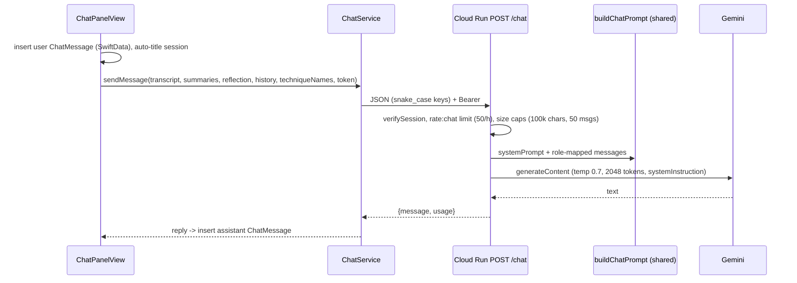

# Self-reflection, coaching chat and report export

These three features run after an `Analysis` exists (see [lesson workflow](lesson-workflow.md)) and are the product's coaching layer: teachers think first, compare, then converse.

## Reflection wizard

`ReflectionFlowView` is an inline five-step wizard (`totalSteps = 5`): what went well -> what to change -> self-rate each technique (1-5, `SelfRatingPicker`, same scale as `RatingLevel`) -> pick focus techniques -> review. It persists to the `Reflection` model (`whatWentWell`, `whatToChange`, `selfRatingsData` as `[TechniqueSelfRating]`, `focusTechniqueIdsData`, `isComplete`, `wasSkipped`), related one-to-one to `Recording` with cascade delete. Teachers may skip straight to feedback (`wasSkipped`). `ReflectionComparisonView` then shows self-ratings beside AI ratings with deltas. Ratings are keyed by `Technique.id`, so id stability matters ([frameworks](frameworks-and-techniques.md)). Re-analysis clears the stale reflection and chats (`RecordingDetailView.startAnalysis`), except the "re-analyze as new session" copy path which leaves the original intact.

## Coaching chat

- Context assembly is client-side in `ChatPanelView.sendMessage`: `ChatService.formatTimestampedTranscript` emits `[M:SS-M:SS] text` per segment plus `[N.Ns pause]` markers where a stored pause starts within 0.5 s of a segment end (this is how pauses reach the model); `buildTechniqueEvaluationsSummary` lists each technique with rating, "[not observed]", feedback and evidence; `buildReflectionSummary` returns nil unless the reflection `isComplete` and not `wasSkipped`, and yields a `### Teacher's Self-Reflection` block.
- Video-only recordings without a transcript auto-extract audio and transcribe on demand (`startTranscriptExtraction`, using `AudioExtractionService` and `TranscriptionService`).
- Errors: `ChatError` maps 429 -> rate limited, 401/403 -> unauthorized, 5xx -> service unavailable. Request timeout is 120 s.
- Persistence: `ChatSession` (title defaults to "New Chat", set from the first 40 chars of the first message) with cascade-deleted `ChatMessage`s (`role` is the string `user`/`assistant`). The backend maps `assistant` to Gemini's `model` role ([shared prompts](../backend/shared-prompts.md)); the route is documented in [Cloud Run API](../backend/cloud-run-api.md). The [Cloudflare Worker](../backend/cloudflare-worker.md) has no `/chat`.
- Replies are rendered by `MarkdownText`, a small custom parser (bullets, numbered items, headings, bold/italic; horizontal rules dropped), tested in `MarkdownParserTests`. The chat prompt asks the model to use only that light subset, so extend both together.

## Export

`ExportService.export(analysis:recording:configuration:)` switches on `ExportConfiguration.format`. PDF path: build `PDFContentBlock`s from the configuration (sections: summary, strengths, growth areas, techniques, next steps, optional self-reflection), pack them into pages with `PDFPagePacker.packIntoPages` using heights from `PDFBlockMeasurer` and `PDFLayout`, render each page view with `ImageRenderer` into a `CGContext` PDF, then present a save panel. A strengths/growth block switches from side-by-side to stacked when it would exceed 40% of the content height. Markdown path writes plain text with the same section toggles. `ExportError.saveCancelled` is swallowed by the caller. The UI is `ExportConfigurationSheet` plus `ExportableAnalysisView`.

## Change guidance

- Changing the `/chat` payload: update `ChatRequest` CodingKeys in `ChatService.swift` and `ChatRequest` in `CloudRunBackend/src/routes/chat.ts` together, plus `buildChatPrompt`. Backend tests cover only unauthenticated rejection; verify manually against a dev backend.
- Adding an export section: add a `PDFContentBlock` case, measurer and view for it, a toggle in `ExportConfiguration`, and the Markdown branch.
- No automated tests exist for the wizard, `ChatService`, or export; only `MarkdownParserTests` applies in this area. Run it with the `-only-testing` form above (needs macOS + Xcode; the Swift app is not in CI).
