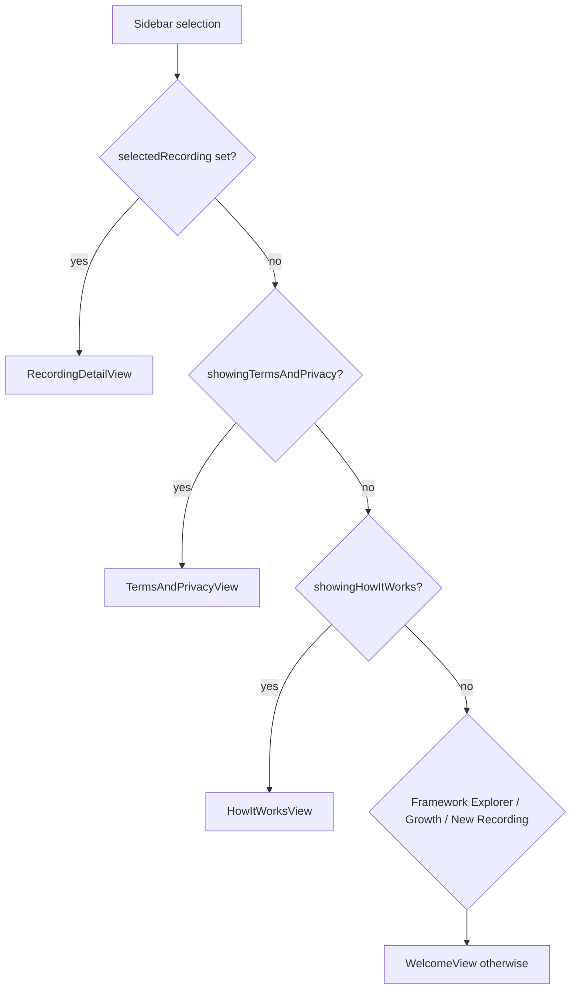

# Settings, How It Works and Terms/Privacy views

These are the app's preference and explanatory surfaces. They share one boundary: they do not call the [Cloud Run API](../backend/cloud-run-api.md), and their only persistent state is the `UserSettings` row in SwiftData. The rest of the app reads that row when it builds an analysis or renders a transcript, so changes here have effects in the [lesson workflow](lesson-workflow.md) and the [frameworks catalog](frameworks-and-techniques.md).

**Consult this page when** adding a user preference, changing which technique is enabled by default, or editing the privacy and legal copy shown in the app.

## Where each surface lives

- **Settings window.** `LessonLensApp` declares a macOS `Settings` scene that shows `SettingsView` (with the shared `ModelContainer` and `ServiceContainer`). It is separate from the main window.
- **How It Works and Terms/Privacy.** These are not separate windows. `MainView` in `Core/Views/ContentView.swift` has `showingHowItWorks` and `showingTermsAndPrivacy` flags set from the sidebar. The detail pane checks them in this order: selected recording, Terms, How It Works, Framework Explorer, Growth dashboard, New Recording, Welcome.

*Detail-pane precedence in `MainView`: a selected recording always wins over the informational views.*

## Settings tabs

`SettingsView` is a `TabView` with four tabs. It is 500x400 and has no tests.

| Tab | Controls | Persisted where |
|---|---|---|
| General (`GeneralSettingsTab`) | "Show timestamps in transcript" toggle; a button that opens the recordings folder in Finder | `UserSettings.showTimestamps` |
| Techniques (`TechniquesSettingsTab`) | Framework segmented picker; per-technique toggles grouped by `TechniqueCategory`; Select All / Deselect All; info popover with look-fors and up to three example phrases | `selectedFrameworkId` and `frameworkTechniqueSelectionsData` (JSON map from framework raw value to technique ids) |
| Account (`AccountSettingsTab`) | Shows name and email from `AppState.currentUser`; Sign Out calls `appState.signOut()` | Not stored here; sign-in state lives in [auth and config](auth-and-config.md) |
| About (`AboutTab`) | Version and build from the bundle, district and "Powered by WhisperKit and Gemini" credits | Nothing |

The General tab's storage label reads `~/Library/Application Support/com.peninsula.lessonlens/`, but the "Open Recordings Folder" button opens the `Recordings` subfolder of that directory. Keep the two in step if the storage location changes.

### How a change is saved

`SettingsView` keeps its own `@State` copy of the preferences. `loadSettings()` fetches the `UserSettings` row whose `userEmail` matches `AppState.currentUser.email`, or inserts a new row with defaults (framework `tlac`, all techniques enabled). Each `onChange` handler calls `saveSettings()`, which copies the state into the row and calls `modelContext.save()`. Switching the framework reloads the technique set for the new framework before saving.

## UserSettings (SwiftData model)

`Core/Models/UserSettings.swift` is a `@Model` with one row per user. Its fields fall into three groups:

- **Read by app code:** `showTimestamps` (transcript rendering in `RecordingDetailView`), `includeRatingsInAnalysis` (default for the analysis configuration sheet, which both `AnalysisConfigurationSheet` and `RecordingDetailView` read and write), and the framework and technique selections.
- **Persisted but not read:** `defaultRecordingTitle`, `autoStartTranscription`, `autoStartAnalysis`, `compactFeedbackView`. A search of `LessonLens/` finds no reader for them, so changing them has no effect today. Wire a reader before exposing them in the UI.
- **Legacy:** `enabledTechniquesData` is the pre-per-framework list, kept only as a fallback for TLAC.

`selectedFramework` falls back to `.tlac` when the stored raw value is unknown. `enabledTechniqueIds(for:)` returns the stored list for a framework when it is non-empty, then the legacy list for TLAC, then `FrameworkRegistry.defaultEnabledIds(for:)`. Technique ids are the join key used by the backend and by reflections, so the stored ids must match the registry ([frameworks and techniques](frameworks-and-techniques.md)).

## How It Works (`HowItWorksView`)

A static explainer with three steps (record or import; choose a framework; receive feedback) and a privacy panel. The copy says that audio is transcribed on-device and never uploaded, that video is sent to Google for analysis and deleted afterward, and that LessonLens is voluntary and not an evaluation tool. Those claims describe the data flow in the [architecture overview](../architecture/overview.md). If the pipeline changes, update this copy and the Terms view together.

## Terms of Use and Privacy (`TermsAndPrivacyView`)

The full policy is hardcoded Swift text in `TermsAndPrivacyView.swift`, not loaded from `docs/`. It has a visible "DRAFT - Pending Legal Review" banner, a "Last Updated" date and 13 numbered sections: overview, eligibility (`@psd401.net` only), voluntary use, data collected, processing, who can see data, retention and deletion, third-party services, student data, AI disclaimer, security, policy changes, and contact.

Section 4 and section 5 describe what the app sends and stores, so they must match the behavior in [lesson workflow](lesson-workflow.md) and [auth and config](auth-and-config.md). Treat any edit to this text as a legal-review change: the banner and date are intentional and should only be changed with the review.

## Change recipes

- **Add a user preference that changes behavior:** add a stored property with a default to `UserSettings` (SwiftData migration is handled by the store-reset fallback in `LessonLensApp`; see [app overview](overview.md)), add a control in the matching `SettingsView` tab, copy it into `@State` in `loadSettings()`, write it back in `saveSettings()`, and add the reader where the behavior lives.
- **Change default technique selection:** the defaults come from `FrameworkRegistry.defaultEnabledIds`; changing the stored-empty fallback in `UserSettings.enabledTechniqueIds(for:)` affects every framework.
- **Edit legal or explainer copy:** edit the Swift strings in the two views; no tests cover them. Keep the claims consistent with the data-flow rules in the [architecture overview](../architecture/overview.md).

## Watch out for

- **Deselect All is not durable.** `saveSettings()` stores `[]`, but `enabledTechniqueIds(for:)` treats an empty stored list as "unset" and returns every technique for the framework. After the Settings window reloads, all techniques are enabled again. Fix this in `UserSettings` if empty selections must be respected.
- **No current user, no settings.** `loadSettings()` returns early when `appState.currentUser` is nil, so Settings edits made in that state are not saved.
- **Settings is a second `ModelContainer` consumer.** It shares the same schema as the main window (`LessonLensApp`); a schema change must update both.

## Validation

- Narrow: there are no focused unit tests for these views or for `UserSettings`. A build is the minimal check: `xcodebuild -project LessonLens/LessonLens.xcodeproj -scheme LessonLens -destination 'platform=macOS' CODE_SIGNING_ALLOWED=NO build`.
- Manual check for preference changes: open Settings, toggle a value, relaunch, and confirm it persists. For technique selection, confirm that Deselect All behaves as described above.
- Expensive or unnecessary: running the full Swift test target is not needed for copy-only changes.
