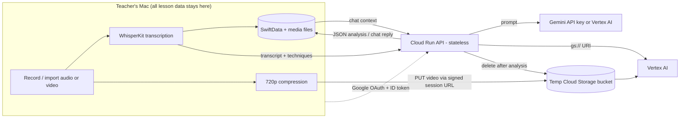

# LessonLens system architecture

LessonLens is a voluntary, privacy-first AI coaching tool for Peninsula School District teachers on Apple Silicon Macs: record or import a lesson, get Gemini feedback against a chosen teaching framework, reflect, and chat with a coach. It is **explicitly not an evaluation tool** (`CLAUDE.md`, `README.md`).

## Components

| Component | Tech | Role | Page |
|---|---|---|---|
| macOS app | SwiftUI, SwiftData, WhisperKit | All user data, UI, on-device transcription, orchestration | [App overview](../app/overview.md) |
| Cloud Run API | Bun + Hono | Auth, rate limiting, prompt building, Gemini/Vertex proxy | [Cloud Run API](../backend/cloud-run-api.md) |
| Video pipeline | Cloud Storage + Vertex AI | Temporary video upload and analysis | [Video analysis pipeline](../backend/video-analysis-pipeline.md) |
| Shared prompts | TypeScript | Prompt builders imported by both backends | [Shared prompts](../backend/shared-prompts.md) |
| Cloudflare Worker | Bun + Hono, KV | Alternative stateless proxy (no chat, no Vertex) | [Cloudflare Worker](../backend/cloudflare-worker.md) |
| Ops tooling | bash, Docker, GH Actions | Build, deploy, sign, release, public docs | [Build/test/CI](../operations/build-test-ci.md), [Deployment/release](../operations/deployment-and-release.md) |

## Runtime data flow

The app is the only stateful part. Transcript text goes to `/analyze`; video goes via Cloud Storage and `/analyze/video`; chat sends the full session context on every call to `/chat`. Results come back as JSON and are written to SwiftData. See [lesson workflow](../app/lesson-workflow.md) for the sequence and status lifecycle.

## Cross-cutting contracts

- **Auth:** Google OAuth (PKCE, `ASWebAuthenticationSession`) -> `POST /auth/validate` -> HS256 session JWT (7 d) + refresh token (30 d) kept in the macOS Keychain; every other route requires `Authorization: Bearer`. Details: [auth and config](../app/auth-and-config.md), [Cloud Run API](../backend/cloud-run-api.md).
- **Wire format:** the app sends camelCase (analysis, video) or snake_case (chat) request keys; responses are snake_case and decoded with `CodingKeys`. The model's JSON schema lives in [shared prompts](../backend/shared-prompts.md). Changes cross three layers: template, route mapper, Swift Codable struct.
- **Rate limits:** per-user per-hour in-memory counters (text 20, video 5, chat 50 by default); deliberately courtesy throttling, not abuse protection.
- **Configuration:** district-specific values (backend host, OAuth client prefix, domain, bundle ID, team) are injected from git-ignored `Local.xcconfig` into `Info.plist`; none are in source. The backend is configured purely by environment variables.
- **Techniques are data:** frameworks are compiled into the app ([frameworks and techniques](../app/frameworks-and-techniques.md)) and sent to the backend as opaque definitions, so adding a framework needs no backend change.

## Invariants to protect when changing anything

1. Do not add server-side persistence of lesson content, logs of transcript text (see `describeGeminiError`, which logs only enum-style fields), or cross-user visibility.
2. Do not upload audio; do not retain video beyond the analysis call (Cloud Storage object deleted in a `finally`; bucket lifecycle is a backstop).
3. Keep domain restriction on both client (`hd` hint) and server (`hd`, email domain, `email_verified`). Never add a dev auth bypass.
4. Keep user-facing and prompt copy as coaching (growth-oriented, no superlatives, no evaluative framing).
5. Keep `JWT_SECRET >= 32` chars and non-empty `GOOGLE_CLIENT_ID` startup checks.
6. Do not hardcode infrastructure identifiers in this public repo.

## Where to go next

- Teacher-facing flow and status lifecycle: [lesson workflow](../app/lesson-workflow.md); post-analysis features: [reflection, chat, export](../app/reflection-chat-export.md).
- Operating and releasing: [deployment and release](../operations/deployment-and-release.md).
