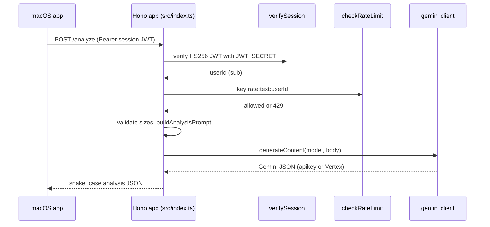

# Cloud Run API

A stateless proxy between the macOS app and Google's Gemini models. It authenticates the teacher, throttles requests, builds prompts from [shared prompt templates](shared-prompts.md), forwards them to Gemini, and reshapes the reply. It stores **no** transcripts, results or sessions - see the privacy invariants in [architecture overview](../architecture/overview.md). Video handling is split out in [video analysis pipeline](video-analysis-pipeline.md). The Cloudflare alternative is in [Cloudflare Worker](cloudflare-worker.md).

**Consult this page when** adding/changing an endpoint, changing sign-in rules, rate limits, model selection, or environment variables.

## Request flow

Every protected route repeats the same sequence: `verifySession(Authorization)` -> `checkRateLimit` (bumps the counter at check time) -> parse JSON -> size validation -> prompt build -> `gemini.generateContent` -> response shaping. There is no shared middleware for auth; each route calls `verifySession` itself.

## Endpoints

| Route | File | Notes |
|---|---|---|
| `GET /` | `src/index.ts` | health payload (`name`, `version`, `status`, `runtime: "Cloud Run"`) |
| `POST /auth/validate` | `routes/auth.ts` | Google ID token -> session JWT (7d) + refresh JWT (30d) |
| `POST /auth/refresh` | `routes/auth.ts` | refresh JWT -> new pair (rotation) |
| `POST /analyze`, `GET /analyze/rate-limit` | `routes/analyze.ts` | transcript analysis; limits: transcript 100,000 chars, 20 techniques, 100 pauses; temperature 0.4, 8192 output tokens, JSON mime type |
| `POST /analyze/video`, `GET /analyze/video/rate-limit` | `routes/analyze-video.ts` | see [video pipeline](video-analysis-pipeline.md) |
| `POST /upload/initiate/gcs`, `POST /upload/initiate`, `POST /upload/status`, `DELETE /upload/:fileName` | `routes/upload.ts` | see [video pipeline](video-analysis-pipeline.md) |
| `POST /chat`, `GET /chat/rate-limit` | `routes/chat.ts` | coaching chat; max 50 messages, 100,000-char transcript; temperature 0.7, 2048 output tokens; uses `systemInstruction` |

Responses use snake_case (`overall_summary`, `technique_evaluations`, `model_used`, `usage`); the Swift decoders in `AnalysisService`/`VideoAnalysisService` map these via `CodingKeys` (see [lesson workflow](../app/lesson-workflow.md)). Gemini failures return 502 with only `{error, status}` - `describeGeminiError` deliberately logs enum-style status/reason fields, never `error.message` or the body, because those can echo transcript text.

## Authentication (`routes/auth.ts`)

- `/auth/validate` verifies the Google ID token with `jose` against Google's JWKS, issuer `accounts.google.com`, **audience = `GOOGLE_CLIENT_ID`**. It then requires `hd === ALLOWED_DOMAIN`, an email whose domain equals `ALLOWED_DOMAIN`, and `email_verified` (defense in depth; failures are 403 and log only the domain, not the email).
- Session JWT: HS256 signed with `JWT_SECRET`, `sub` = Google `sub`, claim `user`. Refresh JWT: claim `userId`, 30 days. `verifySession` only checks signature/expiry and returns `payload.sub`.
- `/auth/refresh` does not re-check the domain or hit a database; it re-issues for the `userId` in the refresh token. The response has no `user` field (the Swift `AuthResponse` in `AuthService.swift` declares `user` as required - see [auth and config](../app/auth-and-config.md)).

## Rate limiting (`src/index.ts`)

`rateLimitStore` is an in-process `Map` keyed `rate:text|video|chat:<userId>`, hourly window, defaults 20 / 5 / 50 via `RATE_LIMIT_PER_HOUR`, `VIDEO_RATE_LIMIT_PER_HOUR`, `CHAT_RATE_LIMIT_PER_HOUR`. This is an explicit, commented design decision: resets on restart, not shared across instances, "courtesy throttling" - real protection is auth, Gemini quotas and Cloud Run limits. Read the comment block before changing it; the migration path noted there is Memorystore (Redis). Tests share this store, which is why `tests/test-env.ts` sets `VIDEO_RATE_LIMIT_PER_HOUR=1000`.

## Gemini backend selection (`gemini-client.ts`, `gcp-auth.ts`)

`createGeminiClient({backend, apiKey, vertexLocation, auth})` returns `generateContent(model, body)`:

- `apikey`: `generativelanguage.googleapis.com/v1beta/models/<model>:generateContent?key=...`.
- `vertex`: `https://<vertexHost(location)>/v1/projects/<project>/locations/<location>/publishers/google/models/<model>:generateContent` with a bearer token. `vertexHost`: `global` -> `aiplatform.googleapis.com`; `us`/`eu` -> `aiplatform.<loc>.rep.googleapis.com` (keeps ML processing in that jurisdiction; the global endpoint does not); otherwise `<loc>-aiplatform.googleapis.com`.
- `createMetadataAuth` reads project ID and service-account access token from the Cloud Run metadata server (cached, refreshed 60 s before expiry), so no project identifier lives in source.

`src/index.ts` creates two clients: `gemini` (text + chat, honours `GEMINI_BACKEND`) and `vertexGemini` (always Vertex; required because Cloud Storage videos are only readable by Vertex).

## Environment

| Variable | Default | Purpose |
|---|---|---|
| `JWT_SECRET` | required, >= 32 chars | startup throws otherwise |
| `GOOGLE_CLIENT_ID` | required | startup throws otherwise (without it `jose` would skip the audience check) |
| `ALLOWED_DOMAIN` | `psd401.net` | server-side domain lock |
| `GEMINI_BACKEND` | `apikey` | `apikey` or `vertex`; `parseGeminiBackend` throws on anything else |
| `GEMINI_API_KEY` | - | needed for `apikey` text/chat and for the legacy Files API video path |
| `VERTEX_LOCATION` | `global` | Vertex location |
| `GEMINI_TEXT_MODEL`, `GEMINI_VIDEO_MODEL` | `gemini-3.8-flash` | model ids |
| `VIDEO_BUCKET` | unset | when empty `videoStorage` is `null` and Cloud Storage routes return 503 |
| `PORT` | `8080` | server port |

`src/index.ts` also installs permissive CORS (documented as intentional: native client only), `X-Content-Type-Options`/`X-Frame-Options` headers, a generic 500 handler and a JSON 404 that echoes the path.

## Change recipes

- **Add a protected endpoint:** create `routes/<name>.ts` exporting a `Hono` router, call `verifySession` first, pick or add a rate-limit key prefix, validate input sizes, build prompts via `shared/prompts`, mount with `app.route(...)` in `src/index.ts`, and add a client call in the Swift service. Add tests next to `tests/video-routes.test.ts` style (fake `globalThis.fetch` standing in for metadata server, Storage and Vertex).
- **Change a request/response field:** update the route, the prompt/JSON schema in [shared prompts](shared-prompts.md) if the model output changes, and the Swift `Codable` models; mirror into [Cloudflare Worker](cloudflare-worker.md) only if that deployment is still in use.
- **Add an env var:** extend `Env` and the `env` object in `src/index.ts`; if tests import `src/index.ts`, set it in `tests/test-env.ts` (module is evaluated once per `bun test` run).

## Validation

- Narrow: `cd CloudRunBackend && bun test` (tests: `index.test.ts` HTTP surface/rate limiter/startup validation spawned in a subprocess, `gemini-client.test.ts` backend URL/auth, `video-routes.test.ts`, `legacy-video-routes.test.ts`, `video-storage.test.ts`).
- Conditional: `bun run build` (`bun build src/index.ts --outdir=dist --target=bun`) when imports of `../../../shared` or packaging change; CI runs the org gate per backend dir (see [build, test and CI](../operations/build-test-ci.md)).
- Do not hand-edit `dist/`; there is no committed build output.
