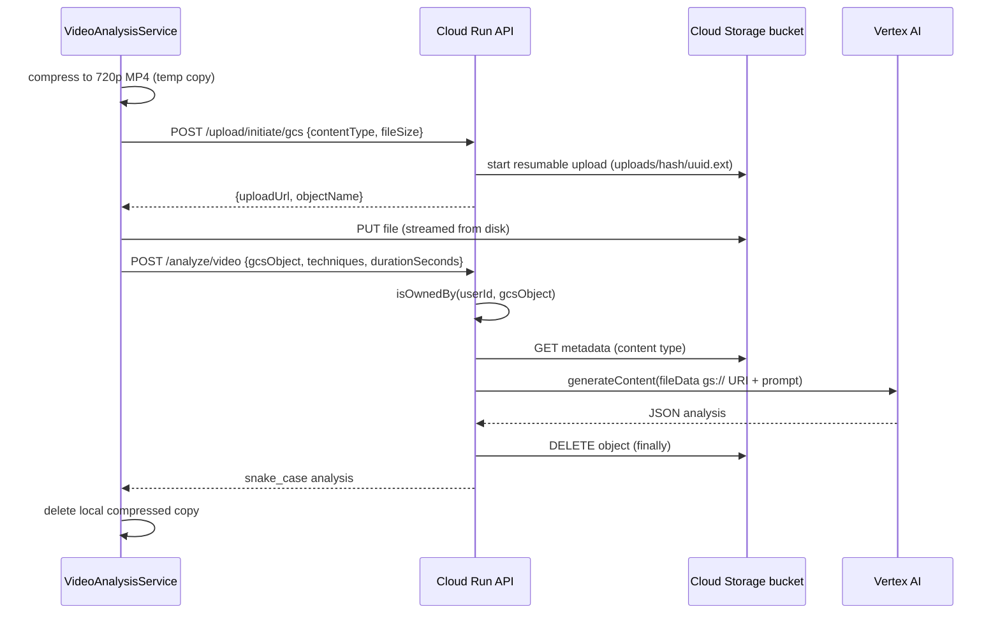

# Video analysis pipeline

Video is the only lesson data that leaves the Mac. The design goal (per the README privacy promise and `video-storage.ts` header) is that the video sits in a private temporary bucket in the district's own Google Cloud project, is readable only by Vertex AI, carries no user details in its name, and is deleted as soon as analysis finishes. This page extends the [Cloud Run API](cloud-run-api.md); the app side is described in [lesson workflow](../app/lesson-workflow.md).

## End-to-end sequence (current path)

1. **Compression** - `VideoCompressionService.compressForUpload` exports a 720p MP4 (`AVAssetExportPreset1280x720`) into `tmp/LessonLensUploads`; the original is never modified. `VideoAnalysisService` rejects an empty result (`compressionFailed`) or one over 2 GB (`compressedTooLarge`; `maxUploadSize`). Progress bar: compression fills 0-30%, upload 30-100%.
2. **Initiate** - `POST /upload/initiate/gcs` (`routes/upload.ts`) requires an allowed content type (`video/mp4`, `video/quicktime`, `video/x-m4v`, `video/webm`), `fileSize` <= 2 GB, and a configured bucket (else 503). The client's file name is ignored: `videoStorage.newObjectName` makes `uploads/<userHash>/<uuid>.<ext>` where `userHash = sha256(userId)` first 32 hex chars.
3. **Upload** - the app PUTs directly to the returned session URL (`URLSession.upload(for:fromFile:)`).
4. **Analyze** - `POST /analyze/video` (`routes/analyze-video.ts`) is rate limited per user under `rate:video:` (default 5/h), requires exactly one of `gcsObject`/`geminiFileName`, max 20 techniques, then `analyzeFromCloudStorage`: ownership check -> `getObject` -> 404 if missing -> 400 if the stored content type is not in `VIDEO_EXTENSIONS` -> Vertex request with a `fileData` part (`gs://bucket/object`).
5. **Long videos** - when the app sends `durationSeconds` above `LONG_VIDEO_SECONDS` (45 min), `videoMetadataFor` adds `videoMetadata: {fps: 0.5}` to cut input tokens roughly a third.
6. **Cleanup** - the `finally` in `analyzeFromCloudStorage` calls `deleteObject` (404 treated as success); the bucket's 1-day lifecycle rule is only a backstop and lives outside the repo (see [deployment](../operations/deployment-and-release.md)).

## Error contract with the app

A Vertex failure returns `502 {error, status}` where `status` is Vertex's HTTP status. `VideoAnalysisService.handleAnalysisResponse` maps 502 with `status == 400` to `videoRejected` (e.g. video too long for the model) and any other 502/5xx to `serviceUnavailable`; 429 -> `rateLimited`. `VideoAnalysisError.offersTranscriptFallback` (`compressionFailed`, `compressedTooLarge`, `videoRejected`) makes `RecordingDetailView` show an inline "analyze from transcript" option instead of an alert. Keep these in sync with the backend if you change status codes (`VideoAnalysisServiceTests` pins the mapping).

## Legacy Gemini Files API path

Kept only for apps released before the Cloud Storage path (`gemini-files.ts` header says it is removed once those apps are retired). `POST /upload/initiate` starts a resumable upload on the Gemini Files API using `GEMINI_API_KEY` and names the file `<userHash>-<timestamp>-<sanitized name>` (`geminiDisplayNameFor`). `POST /upload/status`, `DELETE /upload/:fileName` and `/analyze/video` with `geminiFileName` call `getOwnedGeminiFile`, which returns the file only when `displayName` starts with the caller's hash; other users' files, unprefixed files and missing files are all 404 so existence is not revealed. File names must match `^files/[a-zA-Z0-9_-]+$`. This path polls processing every 5 s for up to 10 minutes, analyzes with `GEMINI_VIDEO_MODEL` via the API key, and deletes the file on success and on error - but only after the ownership check, so another user's file is never touched.

## Invariants and watch-outs

- Ownership is derived solely from the object/display name prefix; never accept a client-supplied object name without `isOwnedBy` (it also blocks path tricks by requiring the exact `uploads/<folder>/<uuid>.<ext>` shape).
- Do not log video analysis content (`formatVideoAnalysis` logs only response length on parse failure).
- Video output reuses the text-analysis response schema (`RESPONSE_SCHEMA_*` in [shared prompts](shared-prompts.md)) so one Swift decoder shape serves both.
- The Cloudflare Worker has only the legacy Files-API video path; see [Cloudflare Worker](cloudflare-worker.md).

## Tests

| Behaviour | Test location |
|---|---|
| `/upload/initiate/gcs` returns session URL + caller-folder object name; validation and 503 | `tests/video-routes.test.ts` > `POST /upload/initiate/gcs` |
| `/analyze/video` with `gcsObject`: ownership, Vertex call, delete on success and failure, fps for long video | `tests/video-routes.test.ts` > `POST /analyze/video with gcsObject` |
| Object-name format, ownership predicate, Storage REST calls | `tests/video-storage.test.ts` > `object names`, `Cloud Storage requests` |
| Legacy ownership (own file OK; other/unprefixed/missing 404; no delete of others') | `tests/legacy-video-routes.test.ts` |
| Swift request body (rounded `durationSeconds`, no `geminiFileName`) and response mapping | `LessonLensTests/VideoAnalysisServiceTests.swift` |

Run Swift tests only when the app side changes (macOS runner required; see [build, test and CI](../operations/build-test-ci.md)).
